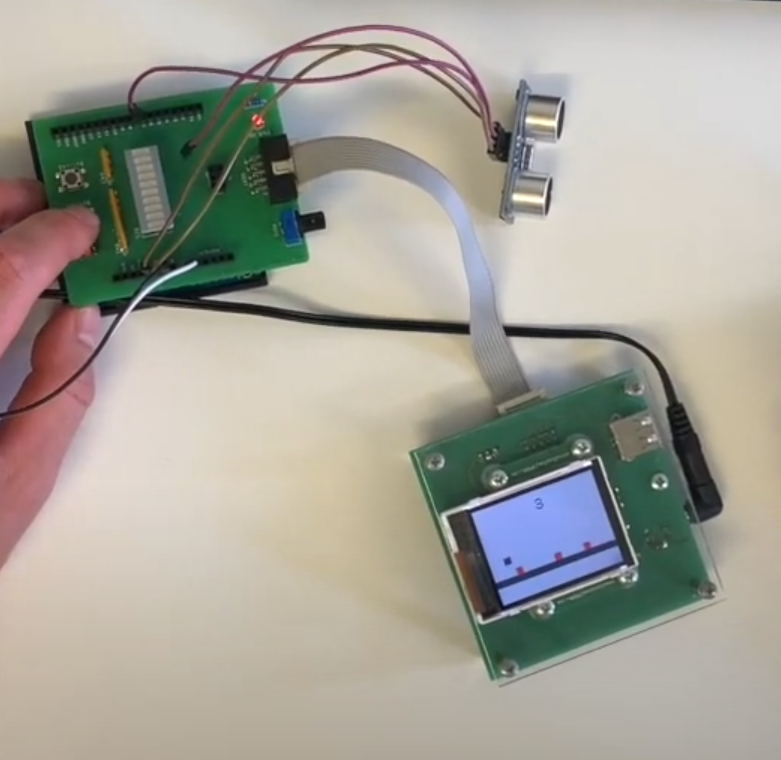

## Atmega328p Jump and Run

- ultrasonic sensor to activate screensaver if no one is using the device
- press button to jump over incoming obstacles
- get points while the game gets faster and faster
- buzzer gets activated when hitting an obstacle

